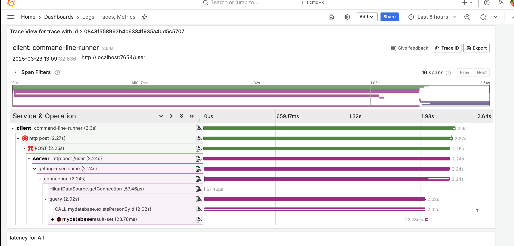
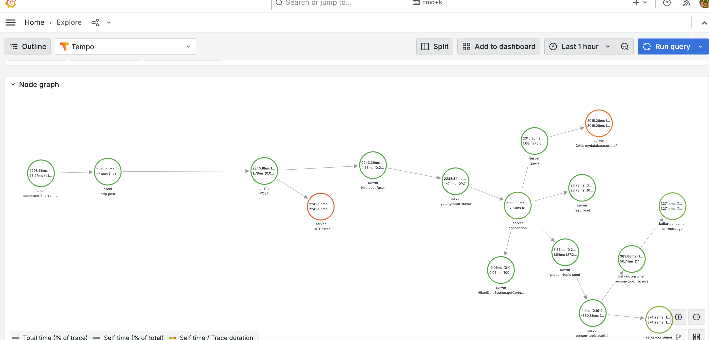
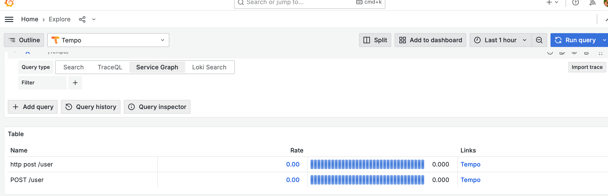

=  Spring Boot <3 OpenTelemetry

Code supporting the blog post related to how Spring Boot works with OpenTelemetry.

== Changes

* Added Kafka Avro Support
* Added Spring Data JPA
* Added Instrumentation for DataSource(`net.ttddyy.observation:datasource-micrometer-spring-boot`)
* Added (Mysql) and sproc to simulate slow queries
* Added String Boot OpenTelemetry Instrumentation(`io.opentelemetry.instrumentation:opentelemetry-spring-boot-starter`)
* Added Otel-Collector

== Building the docs

[source,bash]
----
$ ./mvnw clean install -Pdocs -pl docs
----

== Building the samples

Just run the Maven command to build the samples

[source,bash]
----
$ ./mvnw clean install
----

include::RUNNING.adoc[]
